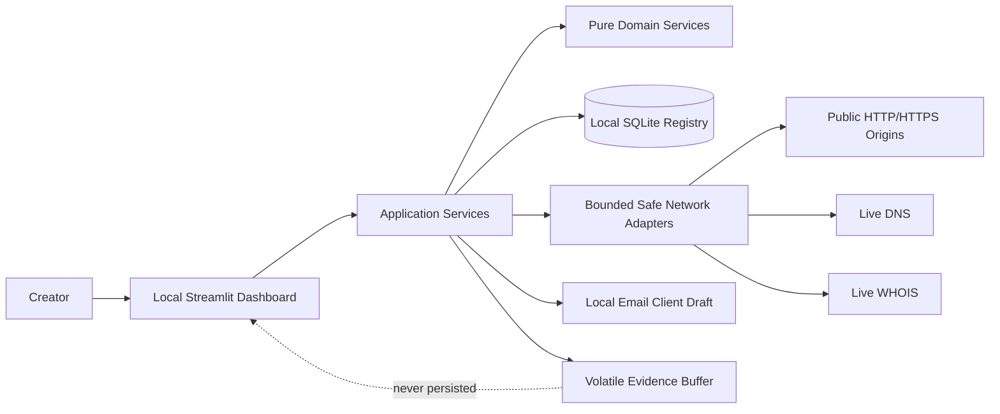
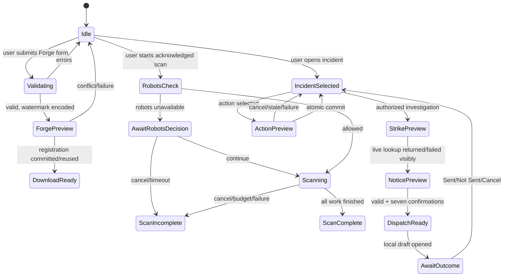

# Provenance Technical Design

## Overview

Provenance is a self-contained, local-first Streamlit application for registering losslessly watermarked images, scanning public web pages for registered marks, reviewing evidence, recording fair-use or credit decisions, and preparing user-controlled copyright communications. The implementation is a Python package with a thin Streamlit shell, pure domain services, explicit side-effect ports, and a SQLite registry. Production paths use only live network responses; test doubles exist only in test code.

This design is normative for implementation. Terms, limits, states, and legal guardrails inherit their exact meanings from `requirements.md`. Where a UI or third-party library cannot itself enforce a requirement, a local adapter owns the missing behavior; the requirement is not weakened.

### Goals and boundaries

- Keep image bytes, creator metadata, evidence, and notice content local except for a user-selected, explicit external action.
- Make hashing, payload coding, watermarking, URL normalization, validation, scan accounting, state transitions, and notice construction deterministic and independently testable.
- Make every database multi-record mutation atomic, recoverable, idempotent where required, and audit-linked.
- Treat all remote and user-provided values as untrusted inert text.
- Perform bounded live HTTP(S), DNS, and WHOIS work with DNS rebinding and peer-address defenses.
- Prepare communication drafts, never send mail.
- Provide evidence and workflow assistance without making legal conclusions.

Out of scope are browser JavaScript execution, autonomous crawling, cloud synchronization, server-side delivery, ownership/infringement/fair-use determinations, and persistent storage of scraped or source image bytes.

### Technology constraints

Runtime dependencies are Streamlit, Pillow, NumPy, requests, beautifulsoup4, python-whois, SQLite through `sqlite3`, and Python standard-library modules. `Hypothesis` is a development-only test dependency. No production fixture, fallback provider response, synthetic match, or simulated evidence path is permitted.

### Research findings that shape the design

1. [Requests advanced usage](https://requests.readthedocs.io/en/latest/user/advanced/#timeouts) states that connect/read timeouts are not whole-operation wall-clock limits and that multiple resolved addresses may multiply connection time. Therefore every network operation also has a monotonic deadline, and the safe transport connects only to a previously validated, pinned address.
2. Requests supports custom transport adapters and streamed responses, but inspecting a default response's peer through private urllib3 attributes occurs too late and is version-fragile. The design therefore implements a `requests.adapters.BaseAdapter`-compatible adapter over standard-library sockets; it verifies the peer before writing HTTP request bytes and exposes a bounded streaming `requests.Response`.
3. [RFC 3912](https://datatracker.ietf.org/doc/html/rfc3912) defines WHOIS as a TCP port 43 text query terminated by CRLF with a response ending at connection close, and notes that response encoding is not declared. Therefore python-whois is used as a parser, while a local socket adapter owns connect/read/total deadlines, peer checks, and byte bounds.
4. [SQLite foreign-key documentation](https://www.sqlite.org/foreignkeys.html) requires foreign-key enforcement per connection. Every registry connection executes `PRAGMA foreign_keys=ON`, verifies it, and uses explicit transactions.
5. [Python `sqlite3` transaction control](https://docs.python.org/3/library/sqlite3.html#transaction-control) permits explicit transaction ownership. Repositories never commit independently; the unit of work owns `BEGIN IMMEDIATE`, commit, and rollback.
6. [Pillow image documentation](https://pillow.readthedocs.io/en/stable/reference/Image.html) distinguishes opening from fully loading image data. Input validation checks dimensions before allocation where possible and calls `load()`/`verify()` in a bounded decode path before hashing or embedding.
7. [python-whois package documentation](https://pypi.org/project/python-whois/) exposes parsed data and identifies its TLD-specific parser architecture. The bounded adapter invokes `whois.parser.WhoisEntry.load(domain, text)` on already-bounded response text rather than calling the package's unbounded network convenience function.

Content derived from the linked sources is rephrased for compliance with licensing restrictions.

## Architecture

### Package and module boundaries

```text
provenance/
  app.py                       # Streamlit entry point and composition root
  ui/
    dashboard.py               # named tabs and route-level rendering
    forge_view.py
    radar_view.py
    triage_view.py
    forms.py                   # typed form adapters and error summaries
    accessibility.py           # labels, live regions, focus bridge
    safe_render.py             # inert text-only rendering
    session.py                 # typed session-state facade and reducers
  domain/
    models.py                  # immutable dataclasses/enums/value objects
    errors.py                  # structured domain failures
    validation.py              # pure field/file metadata validation
    time.py                    # UTC/monotonic clock ports
    canonical_image.py         # RGB canonicalization and SHA-256 identity
    payload.py                 # canonical serializer/parser
    watermark.py               # header, bit packing, embed/extract
    urls.py                    # parse/normalize/public-address predicates
    scan_budget.py             # pure accounting and terminal-state reducer
    discovery.py               # candidate/context extraction
    incidents.py               # pure transition plans
    templates.py               # credit/DMCA compilation and validation
    confirmations.py           # canonical fingerprints/staleness
  application/
    forge.py                   # orchestration; no Streamlit imports
    scan.py
    triage.py
    strike.py
    dispatch.py
    deletion.py
  ports/
    registry.py                # repository/unit-of-work protocols
    http.py                    # safe request protocol
    dns.py
    whois.py
    drafts.py
    logger.py
  infrastructure/
    sqlite/
      connection.py
      migrations.py
      repositories.py
      uow.py
    network/
      resolver.py
      pinned_requests.py
      robots.py
      bounded_whois.py
    email_draft.py             # local mailto/draft opener
    logging.py                 # redacting local diagnostics
  tests/                       # no production imports from this package
```

Dependency direction is `ui -> application -> domain + ports`, with `infrastructure -> ports + domain`. The composition root constructs concrete adapters. Domain modules import neither Streamlit, requests, Pillow file APIs, sqlite3, nor python-whois; `canonical_image` and `watermark` accept NumPy arrays and return typed values.

### System context



### Request and transaction boundaries

Streamlit reruns are treated as short commands. A command receives an immutable input snapshot, invokes one application service once, stores a serializable result in session state, and rerenders. Long network commands run in a single application-owned worker thread with a cancellation token and thread-safe progress queue. Streamlit is called only on the main thread. There is at most one active scan and one active strike investigation per session.

Each persistent command opens one SQLite unit of work. Pure validation and preview construction occur before `BEGIN IMMEDIATE`; database-dependent revalidation occurs inside the transaction. No network I/O, image decoding, UI rendering, or email-client opening occurs while a database transaction is open.

### Streamlit UI and session-state flow

The dashboard creates exactly three tabs: **The Forge**, **Web Radar**, and **Incident Triage**. `SessionModel` is stored under one namespaced key and versioned to allow safe reset after code upgrades.



`SessionModel` contains only:

- active tab and stable focus target;
- forms and validation summaries (including user-entered notice/credit text);
- operation IDs, progress snapshots, cancellation tokens, and terminal summaries;
- one current `EvidenceLease` containing at most source/target representations in memory;
- preview snapshots and confirmation fingerprints;
- session acknowledgements for scan authorization and infrastructure limitations;
- the encoded Forge output only until download/reset;
- no secrets in URL/query parameters or Streamlit cache.

Every button callback includes an operation nonce. Reducers ignore duplicate/stale events. Confirmation is valid only when its stored fingerprint equals a freshly computed preview fingerprint. Changing tabs cancels no completed state, but releases evidence not needed by the one selected incident and moves focus to the active panel heading.

### Accessibility adapter

Streamlit widgets use visible, non-collapsed labels and text descriptions. Status is always text; color and icons are supplemental. Images receive role-specific alternative text. Error summaries preserve input and link to stable field keys.

Requirements for focus movement, dialog return focus, and live announcements are implemented by a small locally owned `AccessibilityBridge` emitted by `ui/accessibility.py`. It contains fixed application JavaScript/CSS only, never retrieved or user-controlled markup. It accepts only an enum focus target and text assigned with `textContent`, uses stable `data-testid`/key wrappers validated against the pinned Streamlit version, maintains an `aria-live` region, and restores opener focus. Startup runs an accessibility compatibility probe; if required hooks are absent, affected actions are disabled with a visible compatibility failure rather than pretending compliance. Automated browser tests gate every supported Streamlit upgrade. This local bridge is not used to render remote content and does not weaken the prohibition on executing retrieved scripts or HTML.

### Requirement traceability by design area

| Design area | Requirements |
|---|---|
| Local layers, tabs, live-only composition | 1, 17, 21 |
| Input validation, image canonicalization | 2, 3.1-3.2, 20.1-20.2 |
| Payload codec and watermark engine | 3, 4, 20.3-20.10 |
| Atomic Forge registration/download | 5, 6, 20.11 |
| Registry schema, UoW, recovery, idempotency | 6, 10, 12, 16, 17.7-17.11, 18 |
| Safe transport and scan budget | 7, 8, 18.1-18.5, 20.13, 20.17 |
| Discovery, context, volatile evidence | 9, 10, 17.3-17.6, 20.20 |
| Triage, whitelist, credit | 11-13, 18.6-18.8 |
| Infrastructure resolution and notice | 14-15, 20.18-20.19 |
| Draft dispatch and audit outcome | 16, 18 |
| Accessibility and accountability | 19, 21 |

## Components and Interfaces

### Shared typed results and clocks

All expected failures are values, not leaked exceptions.

```python
@dataclass(frozen=True)
class Failure:
    code: FailureCode
    operation: str
    fields: tuple[FieldIssue, ...] = ()
    safe_detail: str | None = None
    retryable: bool = False

@dataclass(frozen=True)
class Result[T]:
    value: T | None
    failure: Failure | None

class Clock(Protocol):
    def utc_now(self) -> datetime: ...       # aware UTC
    def monotonic(self) -> float: ...
```

UTC values are sampled once per event, truncated to seconds, and formatted by one strict codec. Durations use only `monotonic()`.

### Input validation and image decode

`ForgeValidator.validate(file_meta, metadata) -> ValidationReport` accumulates every applicable field/category error. It does not hash, decode pixels, or write. `ImageDecoder.decode_bounded(stream, declared_size) -> DecodedSource` performs:

1. reject byte count outside 1..26,214,400 before Pillow;
2. inspect format and dimensions without trusting filename/media type;
3. accept only decoded PNG/JPEG; reject zero dimensions or more than 40,000,000 pixels before full allocation;
4. call Pillow verification/full load in a fresh image handle; map truncated/corrupt/decompression failures to `decode_failure`;
5. normalize pixels to eight-bit RGB (`convert("RGB")`) and separately copy alpha for modes with alpha; reject all post-load dimension changes;
6. return immutable dimensions/media type plus C-contiguous `uint8[h,w,3]` RGB and optional `uint8[h,w]` alpha.

Metadata validation counts Unicode code points with Python `len`, rejects NUL, applies the exact Creator_ID regex `\A[A-Za-z0-9._-]{1,64}\Z`, and uses the exact lightweight email constraints in the requirements (not a stricter RFC validator).

### Canonical image hashing

```python
def canonical_source_bytes(width: int, height: int, rgb: NDArray[np.uint8]) -> Iterator[bytes]: ...
def compute_asset_hash(width: int, height: int, rgb: NDArray[np.uint8]) -> AssetHash: ...
```

The stream is exactly:

```text
50 52 56 4e 2d 53 4f 55 52 43 45 00  # b"PRVN-SOURCE\x00"
width as unsigned 64-bit big-endian
height as unsigned 64-bit big-endian
RGB bytes, row-major, channels R then G then B
```

The function validates shape/dtype/range/contiguity, feeds prefix/dimensions and row chunks to SHA-256, and returns 64 lowercase hex characters. It never includes source encoding, metadata, alpha, EXIF, ICC data, filename, or array stride padding.

### Payload codec

```python
@dataclass(frozen=True)
class WatermarkPayload:
    asset_hash: AssetHash
    creator_id: CreatorId
    created_at: UtcTimestamp

def serialize_payload(fields: Mapping[str, object]) -> Result[bytes]: ...
def parse_payload(data: bytes) -> PayloadParseResult: ...
```

Serialization validates the exact key set and all values first. It emits UTF-8 from `json.dumps` with `sort_keys=True`, `separators=(",", ":")`, `ensure_ascii=False`, and no trailing newline. The resulting member order is `asset_hash`, `created_at`, `creator_id`.

Parsing is strict:

1. decode UTF-8 with `errors="strict"`;
2. parse exactly one JSON value using `JSONDecoder.raw_decode`, rejecting non-whitespace prefix/suffix (canonical comparison later also rejects suffix whitespace);
3. use `object_pairs_hook` to detect duplicate names before dictionary construction;
4. require exactly one object, exact key set, and string values;
5. validate Asset_Hash, Creator_ID, and timestamp using a fixed ASCII regex plus `datetime` Gregorian validation (including years 0001..9999 and seconds 00..59);
6. reserialize represented fields and compare bytes with `hmac.compare_digest` or exact byte equality;
7. return either all three fields or `CorruptWatermark` with no partial identity.

### Watermark header and LSB algorithms

```python
HEADER_SIZE = 13
MAGIC = b"PRVN"
SCHEMA_VERSION = 1

def payload_capacity(width: int, height: int) -> int: ...
def build_header(payload: bytes) -> bytes: ...
def embed(rgb: NDArray[np.uint8], alpha: NDArray[np.uint8] | None,
          payload: bytes) -> Result[EmbeddedImage]: ...
def extract(rgb: NDArray[np.uint8]) -> ExtractionResult: ...
```

Capacity is `max(0, (width * height * 3) // 8 - 13)`. `build_header` returns:

```text
MAGIC (4) || 0x01 (1) || len(payload).to_bytes(4,"big") (4)
|| (zlib.crc32(payload) & 0xffffffff).to_bytes(4,"big") (4)
```

Embedding algorithm:

1. validate RGB shape and payload length; report exact required/available counts if over capacity;
2. concatenate header and payload;
3. expand each byte MSB-first (`bit = byte >> (7-j) & 1`);
4. traverse the row-major flattened RGB channel view (`R,G,B` per pixel);
5. for consumed index `i`, assign `(channel & 0xFE) | bit`; leave all later channels byte-identical;
6. copy alpha without modification and return dimensions unchanged;
7. encode with Pillow as PNG to `BytesIO`, reopen/decode, and byte-compare dimensions, RGB, and alpha before registration.

Extraction algorithm:

1. if fewer than 32 RGB channels, return `NoWatermark`;
2. reconstruct the first four bytes MSB-first; if not `PRVN`, return `NoWatermark`;
3. once magic is present, any shortage before all 104 header bits is `CorruptWatermark`;
4. validate version `1`; parse unsigned big-endian length and CRC;
5. reject length above computed capacity or insufficient bits;
6. reconstruct exactly `length` bytes, verify CRC-32, then call strict payload parser;
7. return `PayloadFound(payload)` only if all checks pass; never classify registry match in this layer.

An image with magic but impossible structure is corrupt. Bit/array operations may be vectorized with NumPy only if tests prove exact equivalence to the reference loop.

### Forge application service

```python
class ForgeService:
    def prepare(self, upload: BinaryIO, metadata: CreatorMetadata, clock: Clock) -> Result[ForgeArtifact]: ...
    def register(self, artifact: ForgeArtifact, approved: CreatorMetadata) -> Result[ForgeOutcome]: ...
```

`prepare` validates, decodes, hashes, samples payload time once, serializes, capacity-checks, embeds, PNG round-trip verifies, and returns volatile bytes plus a registration command. `register` opens a UoW and performs create/reuse/conflict semantics. The download widget is rendered only from a successful `ForgeOutcome` whose registry record fields match the payload. Filename is a sanitized source stem plus `.provenance.png`; path separators/control characters are removed. A failure drops artifact bytes and leaves download unavailable.

### Registry ports and repository APIs

```python
class UnitOfWork(Protocol):
    assets: AssetRepository
    incidents: IncidentRepository
    whitelist: WhitelistRepository
    audits: AuditRepository
    operations: OperationRepository
    def commit(self) -> None: ...
    def rollback(self) -> None: ...

class AssetRepository(Protocol):
    def get(self, asset_hash: AssetHash) -> RegisteredAsset | None: ...
    def register_or_reuse(self, command: RegisterAsset) -> RegistrationOutcome: ...
    def deletion_counts(self, asset_hash: AssetHash) -> DeletionCounts: ...
    def delete_if_preview_matches(self, preview: DeletionPreview) -> DeleteOutcome: ...

class IncidentRepository(Protocol):
    def get(self, incident_id: int) -> Incident | None: ...
    def upsert_detection(self, detection: VerifiedDetection) -> Incident: ...
    def list_active(self) -> Sequence[Incident]: ...
    def list_fair_use(self) -> Sequence[Incident]: ...
    def apply_status_plan(self, plan: IncidentTransitionPlan) -> None: ...

class WhitelistRepository(Protocol):
    def exact(self, asset_hash: AssetHash, page_url: NormalizedUrl) -> WhitelistEntry | None: ...
    def upsert_and_mark_fair_use(self, command: MarkFairUse) -> TransitionSet: ...
    def remove_and_reopen(self, command: RemoveFairUse) -> TransitionSet: ...

class AuditRepository(Protocol):
    def append(self, event: NewAuditEvent) -> AuditEvent: ...
    def by_operation_key(self, key: str) -> CommittedOperation | None: ...
```

Repository methods never call commit. Confirmed multi-record actions first compute a pure transition plan, then re-read and validate current rows inside `BEGIN IMMEDIATE`, mutate all rows, append exactly one audit event, persist an operation receipt, and commit. The operation key is SHA-256 over canonical JSON of operation type, target identifiers, requested values, and content hash. An identical retry returns the receipt without mutation.

### Schema migration and recovery

`MigrationRunner` owns ordered, embedded SQL migrations. On startup it:

1. opens a local path without exposing it as a URL;
2. enables and verifies `foreign_keys`, sets `busy_timeout`, and uses rollback-journal mode with `synchronous=FULL` for straightforward crash semantics;
3. applies each pending migration in `BEGIN EXCLUSIVE`, records version/checksum in `schema_migrations`, and refuses modified/checksum-mismatched migrations;
4. runs `PRAGMA integrity_check` and `PRAGMA foreign_key_check` to completion;
5. exposes a read/write registry only for zero reported rows; otherwise exposes read-only diagnostics and disables every write for the session.

SQLite atomic commit/recovery provides pre-transaction state after an uncommitted process death and complete state after commit. Operation receipts make the latter safely retryable.

### URL parsing, normalization, and public-address checks

```python
def parse_page_input(text: str) -> Result[AbsoluteHttpUrl]: ...
def normalize_url(url: AbsoluteHttpUrl) -> NormalizedUrl: ...
def is_public_network_address(value: str) -> bool: ...
```

A bare domain becomes `https://<domain>/`. Acceptance requires absolute `http`/`https`, no userinfo, a valid IDNA host, and effective port 80 or 443. Normalization lowercases scheme and IDNA ASCII host, removes default port, maps empty path to `/`, removes dot segments without decoding/re-encoding path or query, drops fragments, and preserves path case and query bytes. Invalid percent escapes or ambiguous host syntax are rejected. The IP predicate parses with `ipaddress`, rejects loopback/private/link-local/multicast/unspecified/reserved/non-unicast, and rejects IPv4-mapped IPv6 when its mapped IPv4 is excluded.

### SSRF-safe pinned Requests adapter

`SafeHttpTransport` uses Requests request preparation and response types, but not the default `HTTPAdapter` connection establishment.

```python
class SafeHttpTransport(Protocol):
    def stream(self, request: SafeRequest, budget: BudgetLease,
               cancel: CancellationToken) -> Result[SafeResponse]: ...

class PinnedSocketAdapter(requests.adapters.BaseAdapter):
    def send(self, request: PreparedRequest, *, pinned: Resolution,
             connect_deadline: float, next_byte_timeout: float,
             total_deadline: float, stream: bool = True, **kwargs) -> Response: ...
```

Per attempt sequence:

1. parse and reject scheme/port/userinfo/host before DNS;
2. resolve immediately with `socket.getaddrinfo`; require at least one A/AAAA and require **every** answer public;
3. freeze canonical addresses in `Resolution` with resolution monotonic time;
4. try pinned addresses only, each with the remaining portion of the single five-second attempt deadline—not five seconds per address;
5. connect the socket directly to the selected IP; compare `getpeername()` to the pinned set and public predicate before writing any HTTP request bytes;
6. for HTTPS, wrap with `ssl.create_default_context()` using the original IDNA hostname for SNI/certificate verification, then recheck the underlying peer before HTTP bytes;
7. send a prepared origin-form request with the validated Host header; proxies, environment proxy variables, authentication from URLs, `.netrc`, retries, and automatic redirects are disabled (`Session.trust_env=False`);
8. parse status/headers under the next-byte and total deadlines; expose a raw body reader that sets a 15-second socket timeout before each receive, checks cancellation/120-second deadline before and after each read, and emits received body bytes once to `ScanBudget.consume`;
9. close on every violation before retaining/analyzing over-limit bytes.

The adapter is deliberately implemented against public Requests `BaseAdapter`, `PreparedRequest`, and `Response` APIs plus `socket`, `ssl`, and `http.client`; it does not reach through `response.raw._connection.sock`. This addresses the practical limitation that default Requests peer inspection is both late and private. Connection pooling is disabled because each attempt requires fresh DNS and peer binding.

Redirects are handled by `RedirectController`, not Requests. It resolves `Location` against the current response URL, allows at most five redirects, discards/limits the redirect body under the same total-byte budget, and repeats all URL, DNS, public-address, and peer checks before the next request. No cookies or authorization headers flow cross-origin.

### Robots and scan-budget enforcement

A scan creates one immutable `ScanLimits` and mutable, thread-confined `ScanBudget` using a monotonic start. Robots URL is the destination origin plus `/robots.txt`; it uses the same user agent, safe transport, byte accounting, redirects, and deadlines. `urllib.robotparser` evaluates rules. Disallow ends the scan before page/image requests. Network/server failure yields `AwaitRobotsDecision`; the scan deadline continues during the pause, and only an explicit session-bound continue resumes.

`ScanBudget` owns counters and leases:

- HTML: 2,097,152 body bytes;
- unique normalized image URLs: 100;
- each image: 10,485,760 encoded image body bytes;
- decoded image: 40,000,000 pixels;
- all robots/page/redirect/image response bodies: 52,428,800 bytes;
- redirects: five per logical request;
- one connection attempt: five monotonic seconds;
- interval to next response body byte: 15 monotonic seconds;
- entire scan including robots pause: 120 monotonic seconds.

Declared `Content-Length` is rejected before body read when it exceeds a relevant remaining limit. Chunk boundaries never affect accounting: bytes are charged by exact `len(chunk)` before retention. The reader requests no more than the smallest remaining allowance plus one sentinel byte; the sentinel is not retained/analyzed and triggers termination. `Accept-Encoding: identity` prevents HTTP content-coding ambiguity; image “compressed bytes” means the encoded image body (PNG/JPEG), not decompressed pixels. At terminal budget/cancel state the scheduler stops, closes active sockets, marks started unfinished items cancelled and unstarted discoveries skipped, and releases buffers while preserving committed completed results.

### HTML discovery, context, and image analysis

```python
def discover_images(html: bytes, final_page_url: NormalizedUrl) -> DiscoveryResult: ...
def context_for(img: Tag, document: BeautifulSoup) -> PageContext: ...
```

Beautiful Soup parses only the bounded final static HTML. For each `img` in document order, candidates are nonempty `src`, then `srcset` entries left-to-right (using a tokenizer that handles descriptors/commas), then `data-src`. Each is URL-joined to final Page_URL, validated as absolute HTTP(S), normalized, and deduplicated in first-occurrence order. Discovery retains and enumerates at most the first 100 unique Normalized_URL values. The scheduler may attempt fewer because of cancellation or another budget limit; every retained value for which no attempt starts is counted as skipped. Candidates after the retained 100 are neither retained nor included in the discovered-candidate summary, preserving the Requirement 18.4 definition of discovered as a unique retained URL.

Context captures only document title text, nearest preceding heading `h1`..`h6`, enclosing `figcaption`, and the element's `alt`; whitespace normalization is deterministic. Ecommerce evidence searches these fields and the containing element for displayed currency amount/code, `price`, `add to cart`, `buy now`, or Product/Offer markup. It records the exact bounded matching text/markup as inert evidence and never labels infringement.

Each eligible image is independently retrieved with the safe transport. Media type must be an image type; dimensions are inspected before full decode; Pillow fully loads within 40 MP. Extraction yields exactly one outcome: verified, no watermark, corrupt, valid-but-unregistered, failure, or cancellation. Registry matching requires both Asset_Hash and Creator_ID. One image failure cannot alter another outcome.

### Volatile evidence lifecycle

`EvidenceBuffer` is an in-memory, non-caching owner keyed by opaque leases. Network bytes and decoded arrays exist only during an image analysis. After outcome creation they are zero-referenced immediately unless that incident is the single current triage selection. The registry stores URLs, context, hashes, extraction status/details, and failure reason, never image bytes. Selection change, scan completion/cancel, Forge reset, or session teardown closes leases and clears `BytesIO`, Pillow images, and NumPy references. No `st.cache_data`, tempfile, disk cache, serialization, or diagnostic representation may receive image data.

Because source image bytes are not stored, side-by-side display is available only while the Forge artifact or another user-supplied current representation is in memory; otherwise the UI shows the required labeled placeholder and retained identifiers/reason.

### Incident, whitelist, audit, and deletion transitions

`IncidentPolicy` returns transition plans; repositories apply them atomically.

- New verified, non-whitelisted key -> one `Detected` incident with equal first/last seen.
- Existing key -> update only last seen/latest context/evidence; retain first seen/status.
- Exact `(asset_hash,page_url)` whitelist -> upsert incident as `Fair Use`, preserve evidence, suppress from active.
- Confirm Mark Fair Use -> validate rationale, upsert one whitelist entry, set every exact-scope incident to `Fair Use`, append one audit.
- Remove whitelist -> delete only exact entry; matching unresolved `Fair Use` incidents become `Detected`, never `Strike Authorized`; append one audit.
- Confirm Request Credit -> set selected incident to `Credit Requested` and append one audit.
- Confirm Strike Authorized -> reject exact whitelist, set status and append one audit, then perform live investigation outside the transaction.
- Cancel/stale/failed confirmation -> no mutation.

Asset deletion is preview/compare-and-swap: the preview stores asset hash and exact dependent/audit counts plus a fingerprint. Confirmation re-counts under `BEGIN IMMEDIATE`; mismatch returns a refreshed preview. Matching confirmation deletes dependent whitelist/incidents and asset, retains audits with tombstone Asset_Hash, and commits atomically.

### DNS and bounded WHOIS infrastructure

DNS uses one five-second monotonic operation lease, `getaddrinfo`, the public-address predicate, deduplication, and bounds of 100 addresses/100 canonical names. It records returned/no-record/failure/timeout and lookup UTC time; no inferred provider is produced.

`python-whois` convenience retrieval cannot guarantee the required connect, next-byte, total, peer, and response-size controls. `BoundedWhoisAdapter` therefore owns wire retrieval and uses python-whois only for parsing bounded text:

1. validate the Page_URL host and resolve each WHOIS server immediately before connecting; all answers must be public;
2. discover the authoritative WHOIS server using the package's server mapping or a bounded referral chain treated as one lookup operation; referrals are strict ASCII hostnames, revalidated, and share one 20-second/1,048,576-byte aggregate lease;
3. connect directly to a pinned public address on TCP 43 with at most five seconds remaining for connect, verify `getpeername()` before sending `<domain>\r\n`;
4. set a 15-second next-byte timeout, read until close as RFC 3912 specifies, stop before retaining byte 1,048,577, and enforce the 20-second monotonic deadline across mapping, referrals, reads, and parsing;
5. decode conservatively (ASCII first, then UTF-8 with replacement only for display), retain raw bounded bytes only for the operation, and call `whois.parser.WhoisEntry.load(domain, text)` on that bounded text; catch package parse/domain exceptions and treat partially parsed or malformed values as unavailable rather than completing them by inference;
6. normalize parser output into bounded complete strings/emails and discard raw text after result construction.

The supported python-whois version is pinned and its `WhoisEntry.load(domain, text)` contract is checked at startup and in adapter tests. If that parser entry point is absent or incompatible, startup disables WHOIS investigation with an explicit dependency incompatibility; it must not fall back to unbounded `whois.whois()`. Registrar/organization are labeled provider candidates. Syntactically valid WHOIS emails are deduplicated and ranked stably: values containing ASCII-case-insensitive `abuse` first, then original order. The user must select a returned address or enter a valid labeled recipient.

### Credit, DMCA, confirmations, and draft dispatch

Pure functions build typed previews:

```python
def build_credit_template(incident: Incident, attribution: str, reply: str) -> Result[CreditPreview]: ...
def compile_dmca(inputs: DmcaInputs, evidence: LockedEvidence) -> Result[NoticePreview]: ...
def fingerprint_preview(kind: str, fields: Mapping[str, str]) -> str: ...
def open_local_draft(card: DispatchCard) -> Result[DraftAttemptId]: ...
```

Credit validation enforces 1..5,000 total code points, immutable exact Asset_Hash/Creator_ID/Page_URL, attribution 1..500, reply contact 1..320, and no NUL. Confirmation stores SHA-256 over length-prefixed canonical UTF-8 fields plus incident ID. Any edit changes the fingerprint and clears confirmation. Commit sets status/audit; a separate user activation opens the exact confirmed template in a chosen communication tool.

DMCA compilation validates all exact ranges and email/telephone rules, inserts locked evidence from the incident/asset/verified match, includes all required statutory statements and disclaimers, and never allows editing locked values. Seven named attestation fingerprints and one delivery-readiness fingerprint bind the exact incident, recipient, subject, and full body. Any relevant edit or refreshed evidence regenerates and clears all confirmations.

`EmailDraftAdapter` uses a local OS URI opener only after explicit activation. It builds a percent-encoded `mailto:` URI from exact recipient/subject/body, checks platform command length before opening, and reports inability rather than writing a temporary `.eml` file or truncating. It cannot observe send completion; after an apparently successful open, UI requires `Sent`, `Not Sent`, or `Cancel`. Only explicit `Sent` writes one audit with recipient, notice SHA-256, confirmation time, and incident ID; full body is never stored. No SMTP library, background task, scheduling, or direct transmission exists.

### Safe rendering, privacy, diagnostics, and accountability

`safe_render.text(value)` permits only Streamlit text APIs (`st.text`, `st.code` for literal bounded evidence, labels/captions) and never `unsafe_allow_html=True`, Markdown interpretation, remote image rendering, or clickable conversion. Local paths remain plain text. Remote HTML/headers/DNS/WHOIS/image text are length-bounded before display.

Diagnostics are local, opt-in file logging is off by default, and no remote handler/telemetry is configured. A structured redactor allows operation ID, failure code, bounded host, counts, durations, and record IDs; it denies image bytes, metadata values, emails, addresses, notice bodies, URL query values, and local paths. User-facing failures use safe categories and never exception dumps.

Scan, triage, whitelist, credit, strike, and dispatch commands require specific user activation. Session acknowledgements gate scans and infrastructure investigation; exact-notice acknowledgement is fingerprint-bound. Every evidence display includes the required non-conclusion labels, and scan summaries disclose that static HTML parsing does not execute browser JavaScript.

## Data Models

### Domain value objects and aggregates

All dataclasses are frozen unless explicitly representing an operation-local accumulator.

```python
AssetHash = NewType("AssetHash", str)
CreatorId = NewType("CreatorId", str)
NormalizedUrl = NewType("NormalizedUrl", str)
UtcTimestamp = NewType("UtcTimestamp", str)

class IncidentStatus(Enum):
    DETECTED = "Detected"
    STRIKE_AUTHORIZED = "Strike Authorized"
    FAIR_USE = "Fair Use"
    CREDIT_REQUESTED = "Credit Requested"

class ExtractionKind(Enum):
    VERIFIED = "verified"
    NONE = "no_watermark"
    CORRUPT = "corrupt_watermark"
    UNREGISTERED = "valid_unregistered"

@dataclass(frozen=True)
class CreatorMetadata:
    creator_id: CreatorId
    display_name: str
    contact_email: str | None
    postal_address: str | None
    rights_statement: str | None

@dataclass(frozen=True)
class RegisteredAsset:
    asset_hash: AssetHash
    creator_id: CreatorId
    registered_at: UtcTimestamp
    width: int
    height: int
    source_media_type: str
    metadata: CreatorMetadata

@dataclass(frozen=True)
class PageContext:
    title: str | None
    heading: str | None
    figcaption: str | None
    alt: str | None
    ecommerce_evidence: tuple[str, ...]

@dataclass(frozen=True)
class Incident:
    id: int
    asset_hash: AssetHash
    page_url: NormalizedUrl
    image_url: NormalizedUrl
    creator_id_evidence: CreatorId
    payload_created_at: UtcTimestamp
    extraction_crc32: int
    context: PageContext
    first_seen_at: UtcTimestamp
    last_seen_at: UtcTimestamp
    status: IncidentStatus

@dataclass(frozen=True)
class WhitelistEntry:
    id: int
    asset_hash: AssetHash
    page_url: NormalizedUrl
    rationale: str
    created_at: UtcTimestamp
    modified_at: UtcTimestamp
    related_incident_id: int | None

@dataclass(frozen=True)
class AuditEvent:
    id: int
    event_type: str
    asset_hash_tombstone: AssetHash | None
    incident_id: int | None
    whitelist_id: int | None
    previous_statuses: Mapping[int, IncidentStatus]
    new_statuses: Mapping[int, IncidentStatus]
    content_hash: str | None
    recipient: str | None
    occurred_at: UtcTimestamp
    operation_key: str
```

`ScanState` contains limits, counters, outcomes by normalized URL, start/deadline, terminal reason, and progress; it is never persisted. `InfrastructureEvidence` distinguishes `returned`, `no_records`, `failed`, and `timeout` independently for DNS/WHOIS and carries source/timestamp per value. `NoticePreview`, `DispatchCard`, and confirmation records are session-only; only hashes and audit metadata persist.

### SQLite schema

Migration 1 creates the following logical schema (SQL shown without repetitive timestamp regex checks for readability; the actual migration includes all checks):

```sql
CREATE TABLE schema_migrations (
  version INTEGER PRIMARY KEY,
  checksum TEXT NOT NULL CHECK(length(checksum)=64),
  applied_at TEXT NOT NULL
);

CREATE TABLE registered_assets (
  asset_hash TEXT PRIMARY KEY CHECK(length(asset_hash)=64 AND asset_hash NOT GLOB '*[^0-9a-f]*'),
  creator_id TEXT NOT NULL CHECK(length(creator_id) BETWEEN 1 AND 64 AND creator_id NOT GLOB '*[^A-Za-z0-9._-]*'),
  registered_at TEXT NOT NULL CHECK(length(registered_at)=20),
  width INTEGER NOT NULL CHECK(width >= 1),
  height INTEGER NOT NULL CHECK(height >= 1 AND width * height <= 40000000),
  source_media_type TEXT NOT NULL CHECK(source_media_type IN ('image/png','image/jpeg')),
  display_name TEXT NOT NULL CHECK(length(display_name) BETWEEN 1 AND 200 AND instr(display_name,char(0))=0),
  contact_email TEXT,
  postal_address TEXT,
  rights_statement TEXT,
  CHECK(contact_email IS NULL OR (length(contact_email) BETWEEN 3 AND 254 AND instr(contact_email,char(0))=0)),
  CHECK(postal_address IS NULL OR (length(postal_address) <= 500 AND instr(postal_address,char(0))=0)),
  CHECK(rights_statement IS NULL OR (length(rights_statement) <= 500 AND instr(rights_statement,char(0))=0))
) STRICT;

CREATE TABLE incidents (
  id INTEGER PRIMARY KEY,
  asset_hash TEXT NOT NULL REFERENCES registered_assets(asset_hash) ON DELETE CASCADE,
  page_url TEXT NOT NULL,
  image_url TEXT NOT NULL,
  creator_id_evidence TEXT NOT NULL,
  payload_created_at TEXT NOT NULL CHECK(length(payload_created_at)=20),
  extraction_crc32 INTEGER NOT NULL CHECK(extraction_crc32 BETWEEN 0 AND 4294967295),
  context_json TEXT NOT NULL CHECK(json_valid(context_json)),
  first_seen_at TEXT NOT NULL CHECK(length(first_seen_at)=20),
  last_seen_at TEXT NOT NULL CHECK(length(last_seen_at)=20),
  status TEXT NOT NULL CHECK(status IN ('Detected','Strike Authorized','Fair Use','Credit Requested')),
  UNIQUE(asset_hash,page_url,image_url)
) STRICT;

CREATE TABLE whitelist_entries (
  id INTEGER PRIMARY KEY,
  asset_hash TEXT NOT NULL REFERENCES registered_assets(asset_hash) ON DELETE CASCADE,
  page_url TEXT NOT NULL,
  rationale TEXT NOT NULL CHECK(length(rationale) BETWEEN 1 AND 500 AND instr(rationale,char(0))=0),
  created_at TEXT NOT NULL CHECK(length(created_at)=20),
  modified_at TEXT NOT NULL CHECK(length(modified_at)=20),
  related_incident_id INTEGER REFERENCES incidents(id) ON DELETE SET NULL,
  UNIQUE(asset_hash,page_url)
) STRICT;

CREATE TABLE audit_events (
  id INTEGER PRIMARY KEY,
  event_type TEXT NOT NULL,
  asset_hash_tombstone TEXT,
  incident_id INTEGER,
  whitelist_id INTEGER,
  previous_statuses_json TEXT NOT NULL CHECK(json_valid(previous_statuses_json)),
  new_statuses_json TEXT NOT NULL CHECK(json_valid(new_statuses_json)),
  content_hash TEXT CHECK(content_hash IS NULL OR length(content_hash)=64),
  recipient TEXT,
  occurred_at TEXT NOT NULL CHECK(length(occurred_at)=20),
  operation_key TEXT NOT NULL UNIQUE CHECK(length(operation_key)=64)
) STRICT;

CREATE TABLE operation_receipts (
  operation_key TEXT PRIMARY KEY CHECK(length(operation_key)=64),
  operation_type TEXT NOT NULL,
  target_ids_json TEXT NOT NULL CHECK(json_valid(target_ids_json)),
  requested_values_hash TEXT NOT NULL CHECK(length(requested_values_hash)=64),
  outcome_json TEXT NOT NULL CHECK(json_valid(outcome_json)),
  audit_event_id INTEGER REFERENCES audit_events(id),
  committed_at TEXT NOT NULL CHECK(length(committed_at)=20)
) STRICT;
```

Audit references are intentionally soft/tombstone references so asset deletion can retain them. Application validation enforces exact Creator_ID/email/timestamp syntax in addition to database defense-in-depth. Canonical JSON columns are generated only by trusted serializers and decoded into typed models.

Indexes:

```sql
CREATE INDEX idx_incidents_active ON incidents(status, last_seen_at DESC)
  WHERE status IN ('Detected','Strike Authorized','Credit Requested');
CREATE INDEX idx_incidents_asset_page ON incidents(asset_hash,page_url);
CREATE INDEX idx_incidents_last_seen ON incidents(last_seen_at DESC);
CREATE INDEX idx_whitelist_incident ON whitelist_entries(related_incident_id);
CREATE INDEX idx_audit_asset_time ON audit_events(asset_hash_tombstone,occurred_at DESC);
CREATE INDEX idx_audit_incident_time ON audit_events(incident_id,occurred_at DESC);
```

Exact URL equality uses SQLite `BINARY` collation (the default), preserving path case and query bytes. No `NOCASE` collation is used for identity keys.

### Transaction recipes

| Command | Isolation and writes |
|---|---|
| Register new/reuse | `BEGIN IMMEDIATE`; select by hash; insert exactly once or return unchanged row; conflict on different creator; commit/rollback |
| Detection upsert | `BEGIN IMMEDIATE`; verify asset+creator; exact whitelist lookup; insert or update last-seen/context; commit independently per completed image |
| Confirmed status action | Revalidate fingerprint/current row; update all planned rows; whitelist mutation if any; one audit; one receipt; commit |
| Asset deletion | Recount and compare preview; delete whitelist/incidents/asset; retain audit tombstones; one audit/receipt; commit |
| Failed command | Catch `sqlite3` error, rollback, verify connection is out of transaction, return sanitized failure |

For scans, a failed Page_URL produces no writes because image scheduling starts only after a valid page response. Each completed verified image commits its own incident so later cancellation preserves completed incidents. For multi-row user actions, no partial state becomes visible before commit. A single-process write lock plus SQLite `BEGIN IMMEDIATE` prevents conflicting Streamlit reruns; reads use separate short-lived connections.

## Correctness Properties

*A property is a characteristic or behavior that should hold true across all valid executions of a system-essentially, a formal statement about what the system should do. Properties serve as the bridge between human-readable specifications and machine-verifiable correctness guarantees.*

The properties below are the nonredundant result of acceptance-criteria prework and reflection. Browser-only presentation, third-party service behavior, and physical socket timing are intentionally covered by example/integration tests rather than mislabeled as universal properties.

### Property 1: Canonical image identity equivalence

For all decodable source images with equal decoded width, height, and eight-bit RGB values at every position, canonicalization and hashing produce the same Asset_Hash regardless of source encoding, metadata, alpha, or array representation.

**Validates: Requirements 3.1, 20.1**

### Property 2: Canonical source difference collision retention

For all generated pairs of Canonical_Source byte sequences that differ in at least one byte, either their SHA-256 values differ or the harness reports and retains the exact generated pair as a collision counterexample.

**Validates: Requirements 20.2**

### Property 3: Payload creation uses exact validated identity and sampled UTC second

For all valid Asset_Hash and Creator_ID values and all injected aware UTC times, payload creation preserves both identifiers and formats the time sampled once, truncated to whole seconds, as the exact required UTC timestamp.

**Validates: Requirements 3.2, 6.12**

### Property 4: Canonical payload codec round trip

For all valid Watermark_Payload values, parsing the serialized value returns exactly the original three fields, and serializing that parsed value reproduces the original canonical UTF-8 bytes byte for byte.

**Validates: Requirements 3.3, 3.4, 20.3, 20.4**

### Property 5: Invalid payloads reveal no identity

For all payload byte strings with invalid UTF-8, invalid/non-object/multiple JSON, duplicate or wrong keys, non-string values, noncanonical encoding, invalid Asset_Hash, invalid Creator_ID, or invalid Gregorian timestamp, parsing returns Corrupt_Watermark with no identity or timestamp fields.

**Validates: Requirements 3.5, 3.6, 3.7, 20.10**

### Property 6: Invalid serializer input emits no bytes

For all serializer input maps that violate the exact field set, string type, Asset_Hash, Creator_ID, or timestamp predicates, serialization reports every invalid field and emits no payload bytes.

**Validates: Requirements 3.8**

### Property 7: Header encoding is exact

For all payload byte strings that fit the target image, the header is exactly `PRVN`, version byte 1, four-byte big-endian payload length, and four-byte big-endian unsigned CRC-32 of those exact payload bytes.

**Validates: Requirements 4.1**

### Property 8: Watermark embedding and extraction round trip

For all generated source RGB images and valid payloads whose serialized size is within capacity, extracting the result of embedding returns exactly the embedded Asset_Hash, Creator_ID, and timestamp.

**Validates: Requirements 4.2, 4.9, 20.5**

### Property 9: Embedding preserves the lossless image invariants

For all successful embeddings, width, height, every alpha value, every seven-most-significant-bit RGB prefix, and every RGB channel after the consumed bit range are unchanged; each consumed least-significant bit equals the corresponding MSB-first header/payload bit.

**Validates: Requirements 4.3, 4.4, 4.5, 4.6, 20.6**

### Property 10: Capacity boundary is exact

For all valid generated dimensions and payloads, a payload of exactly Watermark_Capacity bytes embeds successfully, while every payload larger by one or more bytes is rejected with exact required/available counts and no image or registry effect.

**Validates: Requirements 4.7, 4.8, 20.7, 20.8**

### Property 11: Recognized watermark corruption is never a match

For all images with recognized magic whose version, length, available bits, CRC, canonical JSON, fields, or timestamp is invalid—including a one-bit payload-body mutation with unchanged CRC—extraction returns Corrupt_Watermark and no identity or Verified_Match.

**Validates: Requirements 4.11, 20.9**

### Property 12: Missing magic is No_Watermark

For all RGB channel sequences shorter than 32 channels or whose first reconstructed four bytes are not `PRVN`, extraction returns No_Watermark.

**Validates: Requirements 4.10**

### Property 13: Forge validation is complete and side-effect free on rejection

For all file/metadata combinations, acceptance occurs exactly when every specified size, format, dimensions, pixel, decode, Creator_ID, display-name, email, field-length, and NUL predicate holds; otherwise every applicable issue is reported and hashing, embedding, and registry state remain untouched.

**Validates: Requirements 2.1, 2.2, 2.3, 2.4, 2.5**

### Property 14: Registration is creator-bound and idempotent

For all valid registration commands, the first absent Asset_Hash creates exactly one record; every repeat with the same Asset_Hash and Creator_ID returns that original record without changing timestamp or metadata; a different Creator_ID conflicts without mutation.

**Validates: Requirements 5.2, 5.3, 5.4, 6.4, 20.11**

### Property 15: Failed transactions restore the exact prior registry state

For all generated insertion, update, deletion, constraint, and commit failure points before commit, every table row, field value, relationship, and operation receipt exposed afterward equals the pre-operation state.

**Validates: Requirements 5.5, 6.7, 6.8, 11.8, 17.11, 18.10, 20.16**

### Property 16: Incident detection is confluent and unique

For all collections of zero through 100 verified detections and all permutations starting from identical registry state, processing yields the same unique incident key set; rediscovery changes only last-seen/latest evidence and never duplicates or replaces first-seen.

**Validates: Requirements 6.5, 10.5, 10.6, 18.8, 20.12**

### Property 17: URL normalization is idempotent

For all accepted Page_URL and Image_URL values, normalizing twice yields bytes identical to normalizing once while preserving path case and query bytes and removing only specified default/fragment/dot-segment differences.

**Validates: Requirements 7.1, 7.2, 9.2, 12.4, 20.13**

### Property 18: Unsafe destinations cannot reach DNS or connection

For all destination URLs with unsupported scheme, disallowed effective port, malformed host, or credentials, rejection occurs before DNS; for all DNS outcomes, connection is attempted exactly when the answer set is nonempty and every answer is public.

**Validates: Requirements 7.3, 7.6, 7.8**

### Property 19: Redirects receive independent complete validation

For all base response URLs and redirect locations, the resolved destination is opened only after independently passing URL, effective-port, credential, host, DNS, all-public-address, and pinned-peer policy under its own attempt.

**Validates: Requirements 7.4, 7.9**

### Property 20: Scan hard limits are never exceeded

For all generated response, redirect, decode, cancellation, and monotonic-time event sequences, retained/analyzed HTML, image bytes, decoded pixels, total body bytes, unique attempted images, redirects, connection intervals, next-byte intervals, and total elapsed processing never exceed their specified limits.

**Validates: Requirements 8.4, 8.5, 8.7, 8.8, 8.9, 8.10, 8.11, 20.17**

### Property 21: Byte accounting is invariant under chunking

For all response bodies and every partition of those bodies into transfer chunks, each body byte is charged exactly once and totals/per-response decisions are identical regardless of chunk boundaries or later rejection/disposal.

**Validates: Requirements 8.6, 18.5**

### Property 22: Candidate discovery preserves specified order and uniqueness

For all bounded parsed documents, discovery visits `img` elements in document order, considers nonempty `src`, then `srcset` entries left-to-right, then `data-src`, and emits each valid Normalized_URL at most once in first-occurrence order.

**Validates: Requirements 9.1, 9.2**

### Property 23: Image context is associated exactly with its origin element

For all generated HTML trees and image elements, each resolved candidate carries exactly the document title, nearest preceding heading, enclosing figcaption, alt text, final Page_URL, and ecommerce evidence derived from that originating element.

**Validates: Requirements 9.3, 9.6**

### Property 24: Every attempted image has exactly one terminal category

For all generated scan states, each attempted image belongs to exactly one of Verified_Match, No_Watermark, Corrupt_Watermark, valid-but-unregistered, failure, or cancelled; every unattempted discovered image is skipped, and these categories are disjoint and exhaustive.

**Validates: Requirements 9.5, 18.1, 18.3, 18.4, 18.9**

### Property 25: Nonverified extraction cannot create an incident

For all No_Watermark, Corrupt_Watermark, and valid payload results lacking one registry record matching both Asset_Hash and Creator_ID, the incident key set remains unchanged.

**Validates: Requirements 10.1, 10.2, 10.3, 10.4, 20.20**

### Property 26: Exact whitelist scope partitions incident visibility

For all incident and whitelist sets, an active-status incident is suppressed exactly when both Asset_Hash and full Normalized_URL Page_URL are equal; changing scheme, host, port, path case, path, query, or Asset_Hash prevents suppression.

**Validates: Requirements 10.7, 12.3, 12.4, 12.5, 20.14, 20.15**

### Property 27: Fair-use upsert and removal affect only the exact scope

For all valid rationales and incident sets, marking fair use retains one whitelist row and sets every exact-scope incident to Fair Use; removing it deletes only that row and changes only matching unresolved Fair Use incidents to Detected, never Strike Authorized.

**Validates: Requirements 12.1, 12.2, 12.6, 12.7, 12.8**

### Property 28: Cancelled incident actions are observationally inert

For all selected incidents and proposed actions, cancelling or declining confirmation preserves status, evidence, whitelist entries, and audits exactly.

**Validates: Requirements 11.7, 17.9**

### Property 29: Credit templates preserve locked identity and validate all ranges

For all incidents, attribution text, reply contacts, and editable templates, confirmation is available exactly when total/range/NUL rules hold and the Asset_Hash, Creator_ID, and exact Page_URL are present unchanged.

**Validates: Requirements 13.1, 13.6**

### Property 30: Confirmation fingerprints make every relevant edit stale

For all credit, notice, and dispatch previews, a confirmation is valid only for byte-identical bound incident, recipient, subject, body, and named attestation values; changing any bound value changes the fingerprint and clears every required dependent confirmation.

**Validates: Requirements 13.2, 15.6, 15.9, 16.2, 21.3**

### Property 31: Failed or cancelled credit workflow preserves committed state

For all failure/cancellation stages before communication-tool opening, editable content remains available for review while the last committed incident status and audit set remain unchanged and no direct transmission occurs.

**Validates: Requirements 13.7**

### Property 32: Infrastructure output is bounded and never inferred

For all DNS/WHOIS parser outcomes, displayed evidence contains only complete returned values within each count/length/byte limit, stably deduplicates and ranks valid abuse addresses first, records source/time/status, and adds no inferred provider/contact value.

**Validates: Requirements 14.3, 14.4, 14.5, 14.6**

### Property 33: Valid DMCA inputs produce a complete locked notice

For all valid user identity/contact inputs and complete incident evidence, compilation produces every required statutory statement, disclaimer, and exact locked Asset_Hash, Creator_ID, registration/first-seen times, Page_URL, Image_URL, and verification value.

**Validates: Requirements 15.1, 15.2, 15.3, 15.4, 20.18**

### Property 34: Dispatch readiness is complete and fail-closed

For all combinations of notice fields, evidence, incident status, exact whitelist state, recipient, subject, body, seven attestations, and readiness confirmation, dispatch is enabled exactly when every prerequisite is valid/current; otherwise all invalid, missing, or stale prerequisites are reported and no draft or registry change occurs.

**Validates: Requirements 15.5, 15.7, 15.8, 20.19**

### Property 35: Dispatch cards are exact projections

For all dispatch-ready notices, the card and local-draft request contain recipient, subject, and full body byte-for-byte equivalent to the confirmed preview, subject only to standards-compliant URI percent encoding at the OS boundary.

**Validates: Requirements 16.1, 16.3**

### Property 36: Only explicit Sent records success

For all draft outcomes other than an explicit `Sent` selection for the current attempt, no successful-dispatch audit exists and UI does not claim success; explicit `Sent` creates exactly one audit with recipient, notice hash, confirmation time, and incident identifier but no full body.

**Validates: Requirements 16.5, 16.6, 16.7, 16.8, 16.9**

### Property 37: Sensitive values never enter diagnostic records

For all generated image bytes, metadata, notice bodies, postal addresses, contact emails, URL queries, and local paths passed through failures, diagnostics contain none of those values and expose only approved categories/counts/opaque identifiers.

**Validates: Requirements 17.6, 17.11**

### Property 38: Deletion confirmation is a compare-and-swap

For all asset deletion previews, deletion occurs only when the asset still exists and current dependent/audit counts equal the confirmed preview; otherwise no row changes and a refreshed preview is required.

**Validates: Requirements 17.7, 17.8, 17.10**

### Property 39: Confirmed material actions are atomic and retry-idempotent

For all confirmed status, whitelist, strike-authorization, and dispatch-outcome commands, the complete requested state and exactly one audit commit together; repeating an identical operation key returns the first outcome without row, timestamp, or audit changes.

**Validates: Requirements 18.6, 18.7, 18.8**

### Property 40: Validation summaries are complete and preserve input

For all form submissions containing any subset of invalid fields, the UI model returns one associated issue per violated constraint, preserves all entered values, prevents completion, and selects the error summary as the next focus target.

**Validates: Requirements 19.3, 19.8**

## Error Handling

### Failure model

Every layer maps exceptions to a closed `FailureCode` and preserves the originating operation. UI receives safe, actionable text; diagnostics receive structured redacted context. Expected failures never use stack traces as user messages.

| Family | Representative codes | Required handling |
|---|---|---|
| Validation | `empty_file`, `byte_limit`, `unsupported_format`, `invalid_dimensions`, `pixel_limit`, `decode_failure`, `invalid_field` | Accumulate applicable issues, preserve form, perform no hashing/write |
| Watermark | `capacity_exceeded`, `no_watermark`, `corrupt_watermark`, `png_roundtrip_failed` | Distinguish no mark from corrupt; reveal no partial identity |
| Registry | `checks_pending`, `checks_failed`, `identity_conflict`, `constraint`, `busy`, `commit_failed`, `stale_preview` | Roll back, disable writes when integrity is uncertain, preserve evidence |
| URL/SSRF | `unsupported_scheme`, `port`, `credentials`, `malformed_host`, `dns_failed`, `nonpublic_address`, `peer_mismatch` | Stop before prohibited I/O; close socket; no retry to unvalidated target |
| Robots/HTTP | `robots_disallowed`, `robots_unavailable`, `http_status`, `tls`, `connect_timeout`, `read_timeout`, `redirect_limit` | Pause only where specified; identify affected request; preserve completed image results |
| Resource | `html_limit`, `image_bytes_limit`, `pixel_limit`, `total_bytes_limit`, `scan_timeout`, `cancelled` | Stop before retaining/analyzing excess; cancel/sort remaining work |
| Infrastructure | `dns_no_records`, `whois_no_data`, `whois_malformed`, `whois_limit`, `dependency_incompatible` | Display independent outcomes and only complete live values; never infer |
| Confirmation/dispatch | `stale_confirmation`, `missing_attestation`, `draft_unavailable`, `draft_cancelled`, `outcome_pending` | Fail closed; retain exact preview; never record sent automatically |
| Accessibility/runtime | `ui_compatibility_failed` | Disable affected action and expose textual remediation |

### Propagation and isolation

- Domain validators return all field issues in stable field order.
- Application services add operation context but cannot replace a specific failure with a generic success/empty value.
- A Page_URL failure terminates the scan and produces no scan registry writes. An individual Image_URL failure produces exactly one outcome and permits later eligible work.
- Registry errors are caught outside the UoW context after rollback. If rollback or connection state is uncertain, the session write gate becomes failed and no further mutation is accepted.
- Cancellation is cooperative and checked before scheduling, DNS, connect, request write, each body read, decode, extraction, and commit. A commit already completed is not described as cancelled; its receipt is returned.
- Unexpected exceptions are converted to `internal_error` with opaque correlation ID. The exception may be logged locally only through redaction; sensitive values and full trace arguments are excluded.
- Live data absence remains a visible failure/no-record result. No fixture or cached synthetic response is reachable from production composition.

### Resource cleanup

Socket/response/Pillow/BytesIO objects use context managers and close on every path. Worker completion always releases cancellation handles. Evidence leases are revoked in `finally`. SQLite connections roll back open transactions before close. Draft-opening failure retains only session text, not a temporary file.

## Testing Strategy

### Approach

Testing uses complementary layers:

1. **Property tests** for pure algorithms, transformations, validation predicates, budget/state models, and repository invariants.
2. **Example-based unit tests** for named UI states, legal copy, exact edge cases, and error mapping.
3. **Integration/contract tests** for SQLite transactions/recovery, Pillow/PNG behavior, Requests adapter socket ordering, robots/HTTP streaming, WHOIS parsing, OS draft opening, and Streamlit accessibility.
4. **Manual checks** only where platform UI behavior cannot be fully automated; no requirement relies solely on a manual check when an automated contract is possible.

### Property-based tests

Use `Hypothesis` as a development-only test dependency; it is not imported by production code. Every property above has exactly one corresponding property test with at least 100 successful generated examples (more for codecs/URL/validation where runtime permits). Stateful rule-based machines model registry commands and scan scheduling; test clocks/resolvers/sockets are deterministic in-memory adapters.

Each test includes this exact comment form:

```python
# Feature: provenance, Property 8: Watermark embedding and extraction round trip
```

Strategies include:

- C-contiguous and strided RGB/RGBA arrays, dimensions around header/capacity boundaries, Unicode Creator_ID-adjacent strings, and valid Gregorian timestamps;
- canonical payload objects plus grammar-aware byte mutations (duplicates, key order, whitespace, UTF-8, dates);
- accepted/invalid URLs with IDNA hosts, IPv4/IPv6/mapped addresses, default ports, dot segments, percent encoding, path case, and query bytes;
- response event streams with arbitrary chunk partitions, declared lengths, redirects, clock advances, cancellation points, and candidate outcome partitions;
- SQLite/model command sequences, operation retries, uniqueness collisions, exact whitelist scope variants, and injected failure points;
- notice/template field maps and arbitrary prerequisite subsets.

Hash collision tests do not assert that SHA-256 is mathematically injective. They implement Requirement 20.2: any generated unequal pair that does collide is retained by Hypothesis as the failing example and reported explicitly.

### Unit and edge-case tests

Focused examples cover:

- zero bytes, 26,214,400/26,214,401 bytes, 40,000,000/40,000,001 pixels, PNG/JPEG mode conversions, truncated images, and Pillow decompression warnings;
- header vectors with known length/CRC, fewer than 32/104 channels, exact capacity, capacity+1, unsupported version, impossible length, and body-bit flips;
- year 0001/9999, leap-day validity, second 59/60, duplicate JSON keys, noncanonical whitespace/order, and non-ASCII creator values;
- each Streamlit state, action set, placeholder, disclaimer, acknowledgement gate, stale confirmation, and failed-operation retry;
- every status/whitelist transition, recipient ranking, field maximum, and email/telephone predicate;
- safe rendering of representative HTML, Markdown, script, style, link, image, control character, and long remote values;
- every FailureCode to user-message mapping and redaction allowlist.

### SQLite integration and durability tests

Each test uses a temporary local registry and real `sqlite3` connections:

- migration checksum/version ordering, `STRICT` support, foreign keys enabled per connection, healthy integrity checks, FK violations, and write-gate failure;
- all primary/foreign/unique/check constraints and indexes via query plans for active/scope lookups;
- second-connection invisibility before commit and visibility after commit;
- fault injection before each write and commit, asserting byte-equivalent logical snapshots after rollback;
- subprocess termination before commit and after commit-before-return, followed by integrity/FK checks and identical retry;
- operation receipts proving one audit and unchanged timestamps on retry;
- deletion cascade with retained audit tombstones and stale preview recount;
- scan rule that page failure writes nothing while already committed image incidents survive later cancellation.

### Network adapter contract tests

No test uses public third-party endpoints in the default suite. Local scripted DNS/socket/HTTP/TLS/WHOIS fixtures provide real protocol behavior without becoming production data paths.

For `PinnedSocketAdapter`, an event-recording socket asserts this order for every robots/page/redirect/image request:

```text
URL validation -> DNS -> all-address validation -> connect pinned IP
-> getpeername/public/equality -> TLS+certificate (HTTPS) -> peer recheck
-> HTTP request bytes -> response bytes
```

Tests cover DNS rebinding, mixed public/private answers, IPv4-mapped private addresses, peer mismatch, proxy environment variables, cross-origin redirects, redirect loops, TLS hostname mismatch, slow connect, slow next byte, declared/streamed over-limit bodies, chunk repartition, cancellation, and monotonic deadline crossing. They assert socket close and absence of request bytes at prohibited points.

Robots tests use representative allow/disallow groups for the exact user agent, redirects, unavailable outcomes, explicit continue/cancel, and deadline advancement during pause. Every prepared request is checked for the same nonempty Provenance user agent and project URL.

For WHOIS, a scripted TCP/43 server returns split, delayed, malformed, referral, oversized, non-ASCII, and abruptly closed responses. Tests prove the aggregate 1,048,576-byte/20-second bounds, five-second connect and 15-second next-byte limits, public/pinned peer checks, referral validation, bounded parser input, output caps, and raw-buffer release. An adapter contract test pins the supported python-whois parser entry point; upgrading the package requires this test to pass before deployment.

A small opt-in live smoke suite may be run manually against user-approved public destinations to verify environmental DNS/TLS/WHOIS compatibility. It is excluded from deterministic CI, stores no returned sensitive data, and failures are reported as live failures—never replaced with fixtures in production.

### Streamlit, security, and accessibility tests

A subprocess starts the app for browser tests using a temporary registry; the test command must be one-shot rather than watch mode. Automated browser/accessibility checks verify:

- exactly three named tabs, keyboard-only traversal, no keyboard traps, dialog opener focus restoration, and focus movement after errors/tab/dialog/completion;
- persistent labels/accessibility names, role-specific alt text, textual statuses, error-summary associations, and aria-live updates within one second;
- computed contrast for normal/large text and component states in each supported theme;
- hostile user/remote values remain text nodes with no executable element, navigation, remote image load, or interpreted Markdown;
- no action starts on rerun without the matching user control event; confirmation edits invalidate controls;
- no image bytes, notice bodies, contacts, addresses, or local paths appear in diagnostics, SQLite, temp directories, Streamlit cache, or outbound requests;
- the accessibility compatibility probe fails closed against unsupported Streamlit DOM changes.

### Traceability and release gates

| Requirement group | Primary automated suites |
|---|---|
| 1-2 | startup smoke, Forge property/unit, rendering/browser |
| 3-4 | payload/hash/watermark property vectors |
| 5-6 | Forge orchestration + SQLite atomicity/durability |
| 7-8 | URL/budget properties + pinned transport/robots contracts |
| 9-10 | discovery/context properties + scan/registry integration |
| 11-13 | UI state examples + transition/template properties + SQLite |
| 14 | DNS/WHOIS contract and bounded normalization properties |
| 15-16 | notice/readiness/fingerprint properties + draft adapter integration |
| 17-18 | privacy/redaction properties + deletion/crash/scan isolation integration |
| 19 | browser accessibility and contrast suite |
| 20 | the numbered property suite (minimum 100 examples each) |
| 21 | acknowledgement/fingerprint tests + user-activation browser traces |

A release is blocked unless all property/unit/integration tests pass, migration checksums are stable, registry integrity/FK startup tests pass, the pinned Streamlit accessibility version passes browser tests, and dependency adapter capability checks pass. Production package tests additionally assert that no test fixture module, mock resolver, fake clock, or synthetic evidence provider is imported by the composition root.
